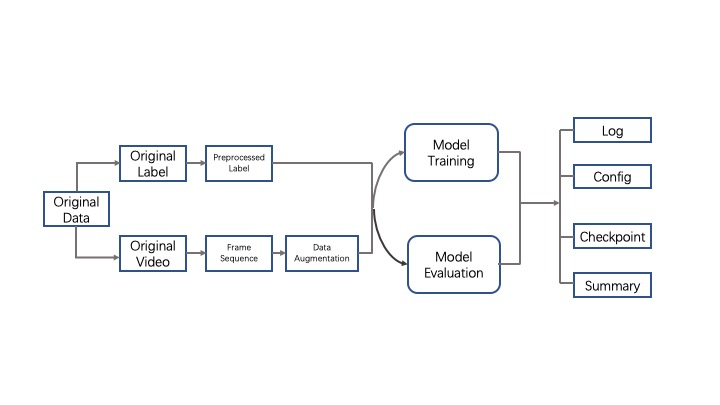

# DLAC
> Version: v20191207
>

## Introduction
This is a framework towards action recognition task based on deep learning. It is mainly constructed by Pytorch. Currently, it assembles some famous models of action recognition. And this framework has some advantages as follows:
1) This is the whole pipeline for action recognition based on deep learning, it contains from data to training of the model, and evaluation of the model. As the following figure shows. 
<div  align='center'>

</div>

2) You only need to modify the configuration file to complete the training and evaluation of the model.
3) For the whole training of the model, the framework can record training info and record training policy. And after evaluating the model, the framework can output evaluation info and statistic info specifically.

## Requirement
* OS: Linux series (better)
* Deep Learning Framework: Pytorch >=1.3
* Others:  requirements.txt

## Usage of DLAC
#### 1. Preparation
In this part, we firstly prepare required software dependency. Before strat working, you should  have installed `pip3`. You can execute the command as follows:
``` bash
pip3 install -r requirements.txt --user
```
#### 2. Prepare Dataset
In this part, we should prepare dataset to train model. Here, we take HMDB51 as an example. In DataTool/HMDB51 directory, you should execute the command as follows:
``` bash
python3 ./hmdb51.py 
```
#### 3. Initalize Framework
In this part, we will start to use the framework. To the whole training and evalutation, `config.py` plays the important role in the frameworrk. Firstly, we need to configure the framework to initalize environment. You should focus on the options as follows:
``` bash
__C.GPUS = 8     # To set your the number of GPU.
__C.USE_DISTRIBUTED = False # If you want to use distributed training, this flag should be set True.
__C.EXP_TYPE = 'T'  # The type of experiment, at training model,you should set 'T'. And at evaluating model, you should set 'E'.
__C.MODEL_NAME = 'tsn' # To set model which is used to training.
__C.EXP_TAG = 'HMDB_BNInception_RGB' # The tag of experiment. It can help you distinguish the different experiment.
__C.BACKBONE = 'BNInception' # The name of the model's backbone.
__C.SNAPSHOT_ROOT = "/data"   # To set root path which can be used to save output from the framework.
__C.DATASET.ROOT_PATH = "/data" # To set dataset's root-path which saves dataset. 
__C.DATASET.VIDEO_SEQ_PATH # If you use the above  'hmdb51.py', you don't  set this parameter. This parameter is used to set video sequence path
__C.DATASET.TRAIN_META_PATH  # The metafile path, to load training data.
__C.DATASET.VAL_META_PATH  #The metafile path, to load validating data.

```
In /Script directory, you can execute the command as follows
```bash
bash ./run_train_dp_m.sh # If you don't use distributed training.
bash ./run_train_ddp_m.sh  -n 1 -g Your GPUs -c 12 # If you use distributed training.
```
#### 4. Download Pretrain Model
In this part, you can download some pretrain models from URL:
BaiduYun Disk :https://pan.baidu.com/s/15zvdVLi9jbJ08W7Q7nSuSQ  Password: dpzy
Then put them into /your root path/ar_output/pretrain_model_zoo/.

#### 5. Train Model
```bash
bash ./run_train_dp_m.sh # If you don't use distributed training.
bash ./run_train_ddp_m.sh  -n 1 -g Your GPUs -c 12 # If you use distributed training.
```
#### 6. Evaluate Model
In this part, if you have finished training once. Then you can evaludate your finished model. Firstly, you should modify `config.py`.
```bash
__C.EXP_TYPE = 'E'
```
Then run the evaluatation scripts in /Script driectory. 
```bash
bash ./run_evaluate_m.sh
```
#### 7. Export Model
You can also export trained model.
``` bash
python3 export_model.py
```
#### 8. Run Demo
You can also product demo instance like output.avi.
``` bash
bash ./run_demo_m.sh
```
## Experiment Show of DLAC

| TOP1   | Training Time | Parallel Method | Loader Method | Backbone    | Segments | Model                 | Modality | Dataset             | BatchSize | LR    | Steps      | Epochs | GPUs |
| ------ | ------------- | --------------- | ------------- | ----------- | -------- | --------------------- | -------- | ------------------- | --------- | ----- | ---------- | ------ | ---- |
| 54.379 | 32.462min     | DP              | DataLoaderX   | resnet50    | 5        | TSN                   | RGB      | HMDB51              | 64        | 0.001 | [20,40]    | 60     | 8    |
| 53.529 | 30.210min     | DP              | DPFlow        | resnet50    | 5        | TSN                   | RGB      | HMDB51              | 64        | 0.001 | [20,40]    | 60     | 8    |
| 53.987 | 27.115min     | DP              | SuperLoader   | resnet50    | 5        | TSN                   | RGB      | HMDB51              | 64        | 0.001 | [20,40]    | 60     | 8    |
| 52.735 | 28.485min     | DDP             | DataLoaderX   | resnet50    | 5        | TSN                   | RGB      | HMDB51              | 64        | 0.001 | [20,40]    | 60     | 8    |
| 52.81  | 20.045min     | DDP             | SuperLoader   | resnet50    | 5        | TSN                   | RGB      | HMDB51              | 64        | 0.001 | [20,40]    | 60     | 8    |
|        |               |                 |               |             |          |                       |          |                     |           |       |            |        |      |
| 53.399 | 21.995min     | DP              | SuperLoader   | BNInception | 5        | TSN                   | RGB      | HMDB51              | 64        | 0.001 | [20,40]    | 60     | 8    |
| 55.098 | 28.009min     | DP              | DataLoaderX   | BNInception | 5        | TSN                   | RGB      | HMDB51              | 64        | 0.001 | [20,40]    | 60     | 8    |
| 54.052 | 25.776min     | DP              | DPFlow        | BNInception | 5        | TSN                   | RGB      | HMDB51              | 64        | 0.001 | [20,40]    | 60     | 8    |
| 53.725 | 17.050min     | DDP             | SuperLoader   | BNInception | 5        | TSN                   | RGB      | HMDB51              | 64        | 0.001 | [20,40]    | 60     | 8    |
| 52.941 | 23.272min     | DDP             | DataLoaderX   | BNInception | 5        | TSN                   | RGB      | HMDB51              | 64        | 0.001 | [20,40]    | 60     | 8    |
|        |               |                 |               |             |          |                       |          |                     |           |       |            |        |      |
| 85.223 | 65.637min     | DP              | DataLoaderX   | BNInception | 5        | TSN                   | RGB      | UCF101              | 64        | 0.001 | [20,40]    | 60     | 8    |
|        |               |                 |               |             |          |                       |          |                     |           |       |            |        |      |
| 70.692 | 134.872min    | DP              | DataLoaderX   | BNInception | 5        | TSN                   | RGB      | ActivityNet Trimmed | 64        | 0.001 | [20,40]    | 60     | 8    |
|        |               |                 |               |             |          |                       |          |                     |           |       |            |        |      |
| 68.372 | 7d16h         | DP              | DataLoaderX   | BNInception | 5        | TSN                   | RGB      | K600                | 64        | 0.001 | [20,50,80] | 120    | 8    |
|        |               |                 |               |             |          |                       |          |                     |           |       |            |        |      |
| 65.805 | 9d            | DP              | DataLoaderX   | resnet50    | 8        | I3D(Dense_Sample)     | RGB      | K600                | 64        | 0.01  | [20,50,80] | 120    | 8    |
|        |               |                 |               |             |          |                       |          |                     |           |       |            |        |      |
| 32.91  | 10d           | DP              | DataLoaderX   | BNInception | 16       | TSN                   | RGB      | SomethingV2         | 64        | 0.001 | [20,40,60] | 80     | 8    |
|        |               |                 |               |             |          |                       |          |                     |           |       |            |        |      |
| 48.509 | 9d            | DP              | DataLoaderX   | mfnet2d     | 16       | MFNet3D(Dense_Sample) | RGB      | SomethingV2         | 64        | 0.01  | [20,40,60] | 80     | 8    |
|        |               |                 |               |             |          |                       |          |                     |           |       |            |        |      |
|        |               | DP              | DataLoaderX   | resnet50    | 32       | SlowFast              | RGB      | K600                | 32        | 0.01  | [20,50,80] | 120    | 8    |

## Tools

./base_workspace.sh is used to install some tools that serves you.
## Reference
The whole framework assembles some famous models. Thank you very much for these creators. These original code of model are from the following URL:
1) http://yjxiong.me/others/tsn/
2) https://github.com/cypw/PyTorch-MFNet